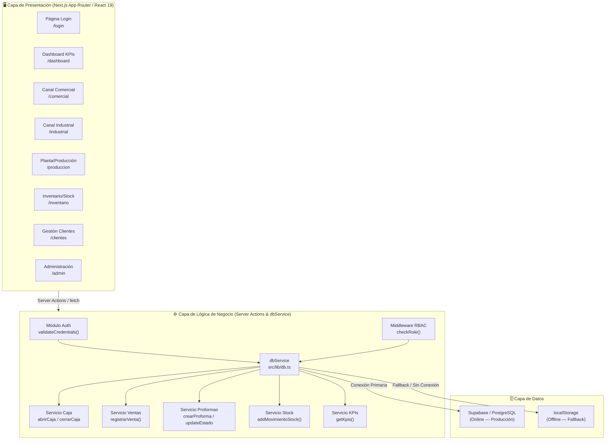
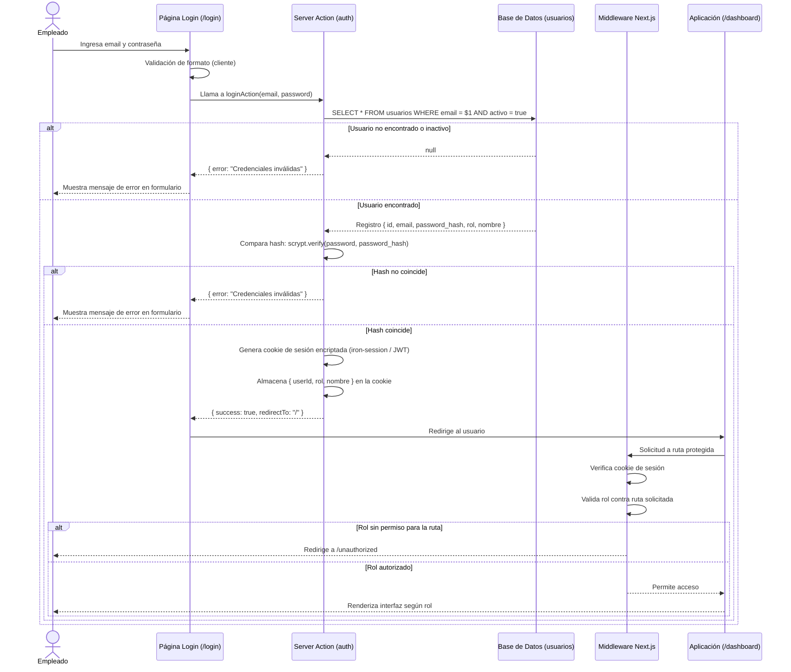
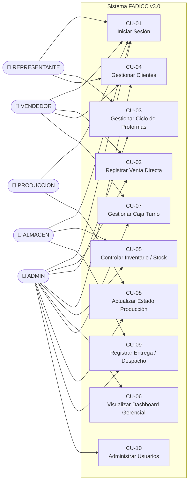
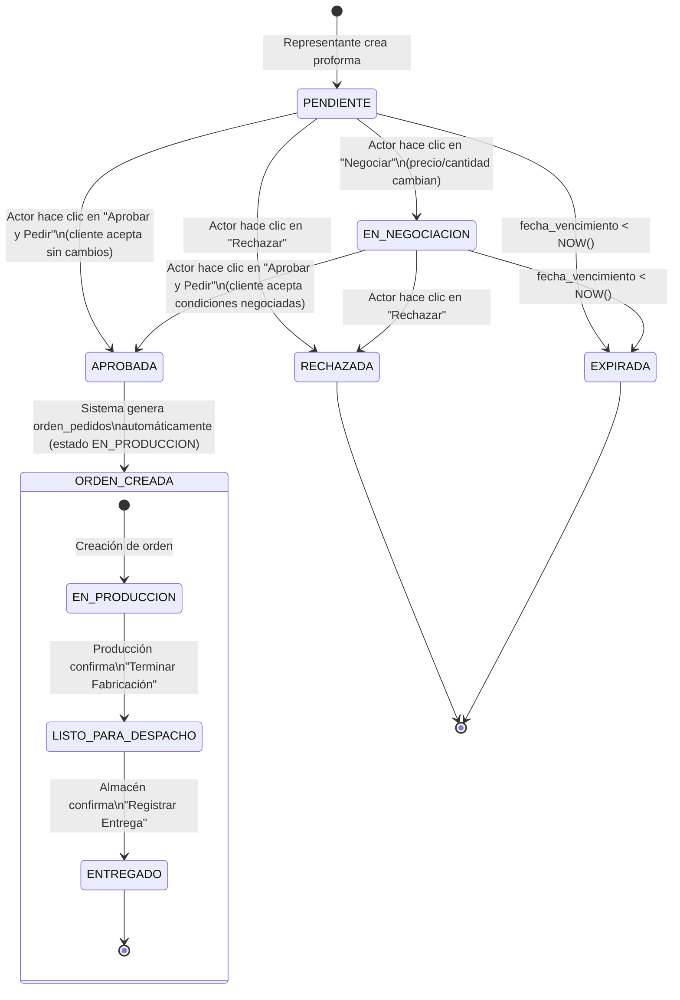
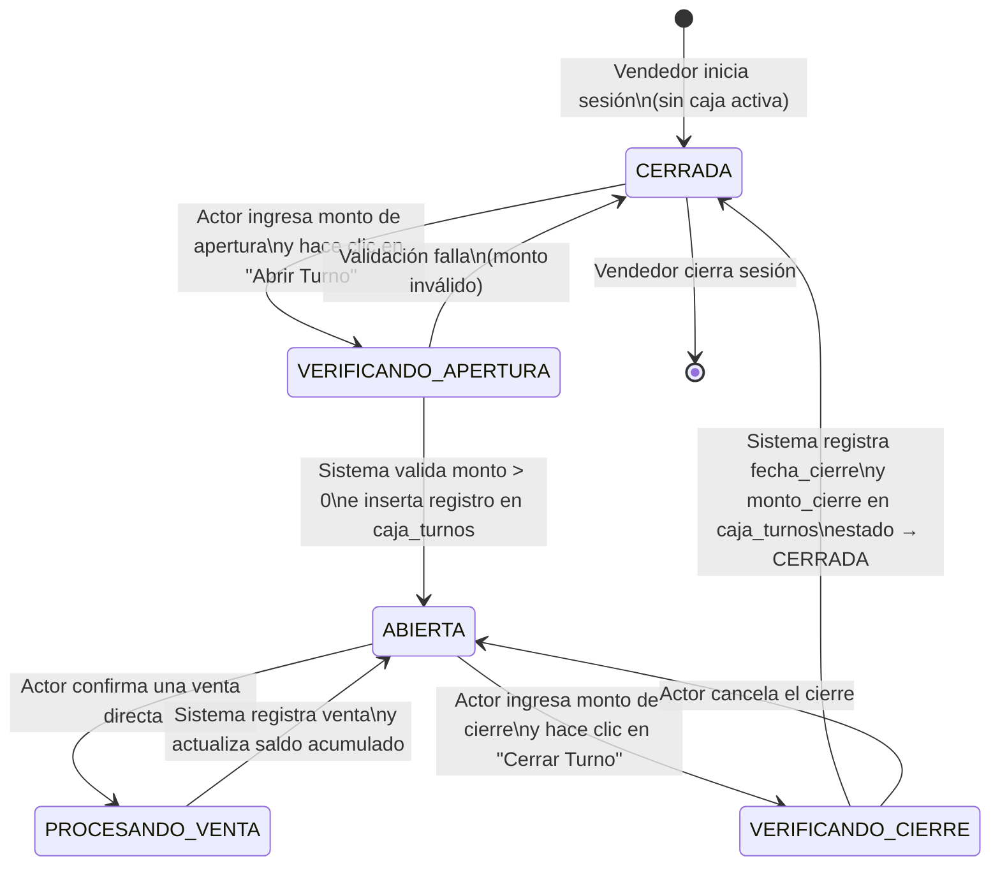
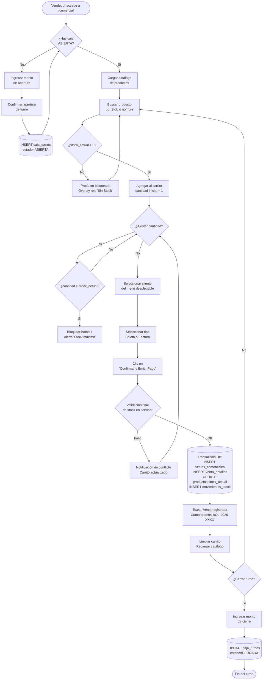
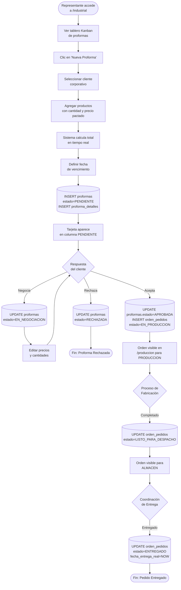
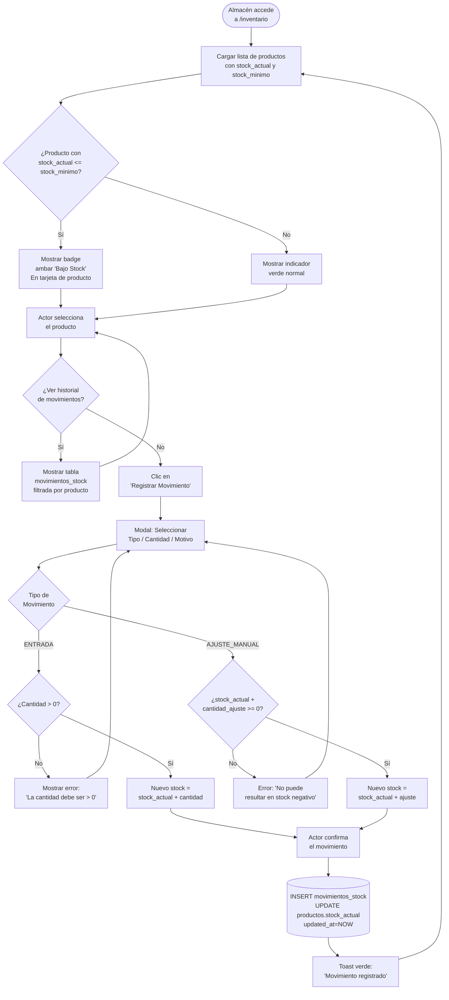

# fadicc_analisis_diseno

**Empresa:** FADICC S.A.
**Versión del Documento:** 3.0
**Fecha de Emisión:** 6 de junio de 2026
**Clasificación:** Uso Interno — Confidencial
**Autores:** Equipo de Desarrollo FADICC

---

## Tabla de Contenidos

1. [Introducción](#1-introducción)
2. [Arquitectura del Sistema](#2-arquitectura-del-sistema)
3. [Modelo de Datos (Entidades y Relaciones)](#3-modelo-de-datos-entidades-y-relaciones)
4. [Control de Accesos (RBAC)](#4-control-de-accesos-rbac)
5. [Casos de Uso](#5-casos-de-uso)
6. [Diagramas de Estado](#6-diagramas-de-estado)
7. [Diagramas de Actividad](#7-diagramas-de-actividad)
8. [Diseño de Interfaces (Especificación)](#8-diseño-de-interfaces-especificación)
9. [API de Servicios (dbService)](#9-api-de-servicios-dbservice)
10. [Plan de Implementación y Roadmap](#10-plan-de-implementación-y-roadmap)

---

## 1. Introducción

### 1.1 Contexto del Negocio

FADICC S.A. es una empresa manufacturera peruana especializada en la fabricación y comercialización de cocinas industriales y domésticas. Opera simultáneamente a través de dos canales de ventas claramente diferenciados: el **Canal Comercial**, orientado a la venta directa en tienda física con emisión de comprobantes (boleta o factura) y control de caja por turno; y el **Canal Industrial**, orientado a clientes corporativos y restaurantes que requieren cotizaciones personalizadas (proformas), negociación de precios por volumen y fabricación bajo pedido diferido. La naturaleza dual del negocio exige un sistema de información que unifique ambos flujos operativos, garantice la trazabilidad del stock, y otorgue visibilidad gerencial en tiempo real del rendimiento comercial.

### 1.2 Objetivos del Sistema

1. **Centralizar la Operación Comercial:** Unificar en una sola plataforma web los procesos de venta directa (canal tienda) y venta por pedido diferido (canal industrial), eliminando el uso de hojas de cálculo y aplicaciones de mensajería para comunicar estados internos.
2. **Garantizar la Seguridad de Acceso:** Implementar un sistema de autenticación real basado en credenciales almacenadas en base de datos, con control de roles (RBAC) que restrinja el acceso a módulos y acciones según la función de cada empleado.
3. **Controlar el Inventario en Tiempo Real:** Mantener un registro actualizado del stock por producto, con alertas de stock crítico, descuento automático en ventas y un módulo de ajustes manuales auditables.
4. **Gestionar el Ciclo de Vida de Proformas:** Cubrir el flujo completo de una cotización industrial: desde su creación y negociación hasta su aprobación, conversión en orden de pedido, seguimiento de producción y registro de entrega.
5. **Proveer KPIs Gerenciales Dinámicos:** Ofrecer al rol ADMIN un dashboard con indicadores clave de rendimiento (ventas del día, tasa de conversión de proformas, alertas de stock, comparativas por vendedor) alimentados directamente desde la base de datos.
6. **Garantizar Resiliencia Operacional:** Implementar un patrón de base de datos dual (Supabase en línea + localStorage como fallback) para asegurar la continuidad operativa del canal comercial ante eventuales interrupciones de conectividad.

### 1.3 Alcance

#### Dentro del Alcance (v3.0)

- Autenticación con email y contraseña (custom auth sobre tabla `usuarios`).
- Control de accesos basado en roles (ADMIN, VENDEDOR, REPRESENTANTE, ALMACEN, PRODUCCION).
- Módulo Canal Comercial: gestión de caja turno, catálogo con validación de stock, emisión de ventas con comprobante.
- Módulo Canal Industrial: creación y gestión del ciclo de vida de proformas, conversión a órdenes de pedido.
- Módulo Producción/Planta: seguimiento de estados de producción y despacho.
- Módulo Inventario: consulta de stock, ajustes manuales, historial de movimientos.
- Módulo Clientes: alta, edición y búsqueda de clientes por documento.
- Módulo Administración: gestión de usuarios del sistema.
- Dashboard gerencial con KPIs dinámicos.
- Patrón dual-mode de base de datos (Supabase / localStorage).

#### Fuera del Alcance (v3.0)

- Integración con SUNAT para emisión electrónica de comprobantes (CEP/OSE).
- Módulo de contabilidad y conciliación bancaria.
- Aplicación móvil nativa (iOS/Android).
- Notificaciones por correo electrónico o mensajería (planificado en Fase 3).
- Exportación de documentos en formato PDF (planificado en Fase 3).
- Multi-empresa o multi-sucursal.

---

## 2. Arquitectura del Sistema

### 2.1 Diagrama de Tres Capas

El sistema sigue una arquitectura de tres capas lógicas: Presentación (frontend renderizado por Next.js App Router), Lógica de Negocio (Server Actions y servicios de datos encapsulados en `dbService`), y Datos (Supabase/PostgreSQL con fallback a localStorage).



### 2.2 Stack Tecnológico

| Capa | Tecnología | Razón de Elección |
| :--- | :--- | :--- |
| **Framework Web** | Next.js 16 (App Router) | Renderizado híbrido SSR/CSR, Server Actions nativos, sistema de rutas basado en archivos, soporte TypeScript nativo. |
| **Biblioteca UI** | React 19 | Concurrent rendering, Suspense mejorado, uso de `use()` hook para promesas asíncronas. |
| **Estilos** | Tailwind CSS v4 | Utility-first, diseño dark mode con glassmorphism, configuración mediante CSS nativo sin `tailwind.config.js`. |
| **Lenguaje** | TypeScript 5 | Tipado estático estricto, IntelliSense completo, reducción de errores en tiempo de ejecución. |
| **Base de Datos** | Supabase (PostgreSQL 15) | BaaS con autenticación, RLS, realtime subscriptions y API REST/RPC automática. |
| **ORM / Cliente DB** | Supabase JS Client v2 | Abstracción tipada de queries, soporte para RLS y funciones RPC de PostgreSQL. |
| **Estado Global** | React Context + `useReducer` | Gestión liviana de sesión de usuario y carrito de ventas sin dependencia de librerías externas. |
| **Fallback Offline** | localStorage (Web API) | Persistencia del carrito y caja turno local en caso de interrupción de la conexión con Supabase. |
| **Linting** | ESLint + Next.js Config | Reglas recomendadas de Next.js y TypeScript para mantener calidad de código. |
| **Entorno** | Vercel (Deploy) | Integración nativa con Next.js, variables de entorno, CI/CD automático desde Git. |

### 2.3 Patrón Dual-Mode de Base de Datos

El servicio `dbService` (ubicado en `src/lib/db.ts`) encapsula toda la lógica de acceso a datos e implementa un patrón de **doble modo** para garantizar la resiliencia operativa, especialmente crítica para el canal comercial donde una interrupción no puede paralizar las ventas.

**Modo Primario (Supabase Online):**
- Al iniciar la aplicación, el servicio verifica la conectividad con Supabase mediante un ping ligero.
- Si la conexión está disponible, todas las operaciones de lectura y escritura se realizan directamente contra PostgreSQL a través del cliente `@supabase/supabase-js`.
- Los datos leídos de Supabase se sincronizan al localStorage como caché local para servir de respaldo.

**Modo Fallback (localStorage Offline):**
- Si el ping a Supabase falla o retorna un error de red, el servicio cambia automáticamente al modo fallback.
- Las operaciones de escritura (nuevas ventas, movimientos de caja) se encolan en localStorage con un flag `_pendingSync: true`.
- Al recuperar la conexión, una función de reconciliación (`syncPendingOperations()`) procesa la cola y persiste los datos pendientes en Supabase, evitando duplicados mediante IDs UUID generados en el cliente.

**Consideración de Seguridad:** Los módulos que requieren consistencia fuerte (administración de usuarios, aprobación de proformas) deshabilitan el modo fallback y presentan un error al usuario si no hay conectividad.

---

## 3. Modelo de Datos (Entidades y Relaciones)

### 3.1 Diagrama Entidad-Relación

```mermaid
erDiagram
    usuarios {
        UUID id PK
        VARCHAR email UK
        VARCHAR password_hash
        VARCHAR nombre
        VARCHAR rol
        BOOLEAN activo
        TIMESTAMPTZ created_at
    }

    clientes {
        UUID id PK
        VARCHAR tipo_documento
        VARCHAR numero_documento UK
        VARCHAR razon_social_o_nombre
        VARCHAR telefono
        VARCHAR email
        TEXT direccion
        TIMESTAMPTZ created_at
    }

    productos {
        UUID id PK
        VARCHAR sku UK
        VARCHAR nombre
        TEXT descripcion
        NUMERIC precio_base
        INT stock_actual
        INT stock_minimo
        TIMESTAMPTZ updated_at
    }

    caja_turnos {
        UUID id PK
        UUID vendedor_id FK
        TIMESTAMPTZ fecha_apertura
        TIMESTAMPTZ fecha_cierre
        NUMERIC monto_apertura
        NUMERIC monto_cierre
        VARCHAR estado
    }

    ventas_comerciales {
        UUID id PK
        UUID cliente_id FK
        UUID vendedor_id FK
        UUID caja_turno_id FK
        VARCHAR tipo_comprobante
        VARCHAR numero_comprobante UK
        NUMERIC total
        TIMESTAMPTZ fecha_venta
    }

    venta_detalles {
        UUID id PK
        UUID venta_id FK
        UUID producto_id FK
        INT cantidad
        NUMERIC precio_unitario
        NUMERIC subtotal
    }

    proformas {
        UUID id PK
        UUID cliente_id FK
        UUID representante_id FK
        VARCHAR codigo_proforma UK
        VARCHAR estado
        TIMESTAMPTZ fecha_emision
        TIMESTAMPTZ fecha_vencimiento
        NUMERIC total
    }

    proforma_detalles {
        UUID id PK
        UUID proforma_id FK
        UUID producto_id FK
        INT cantidad
        NUMERIC precio_pactado
        NUMERIC subtotal
    }

    orden_pedidos {
        UUID id PK
        UUID proforma_id FK UK
        VARCHAR codigo_pedido UK
        VARCHAR estado_produccion
        TIMESTAMPTZ fecha_aprobacion
        TIMESTAMPTZ fecha_entrega_estimada
        TIMESTAMPTZ fecha_entrega_real
    }

    movimientos_stock {
        UUID id PK
        UUID producto_id FK
        UUID usuario_id FK
        VARCHAR tipo_movimiento
        INT cantidad
        TEXT motivo
        TIMESTAMPTZ created_at
    }

    usuarios ||--o{ caja_turnos : "abre/cierra"
    usuarios ||--o{ ventas_comerciales : "realiza"
    usuarios ||--o{ proformas : "gestiona"
    usuarios ||--o{ movimientos_stock : "registra"
    clientes ||--o{ ventas_comerciales : "es cliente en"
    clientes ||--o{ proformas : "recibe"
    caja_turnos ||--o{ ventas_comerciales : "contiene"
    ventas_comerciales ||--|{ venta_detalles : "tiene"
    productos ||--o{ venta_detalles : "incluido en"
    proformas ||--|{ proforma_detalles : "tiene"
    productos ||--o{ proforma_detalles : "incluido en"
    proformas ||--o| orden_pedidos : "origina"
    productos ||--o{ movimientos_stock : "registra cambio"
```

### 3.2 Tabla Descriptiva de Entidades

| Entidad | Atributos Clave | Descripción |
| :--- | :--- | :--- |
| **usuarios** | `id`, `email` (UK), `password_hash`, `rol`, `activo` | Empleados con acceso al sistema. El campo `rol` determina los permisos de acceso (RBAC). La contraseña se almacena como hash (scrypt). |
| **clientes** | `id`, `tipo_documento`, `numero_documento` (UK), `razon_social_o_nombre` | Personas naturales (DNI) o empresas (RUC) que realizan compras en cualquier canal. `numero_documento` es único en el sistema. |
| **productos** | `id`, `sku` (UK), `nombre`, `precio_base`, `stock_actual`, `stock_minimo` | Catálogo de productos fabricados por FADICC. `stock_actual` es el campo de inventario en tiempo real. `stock_minimo` dispara alertas. |
| **caja_turnos** | `id`, `vendedor_id`, `fecha_apertura`, `monto_apertura`, `estado` | Representa un turno de caja abierto por un vendedor. Solo puede haber una caja en estado `ABIERTA` por vendedor simultáneamente. |
| **ventas_comerciales** | `id`, `cliente_id`, `vendedor_id`, `caja_turno_id`, `tipo_comprobante`, `numero_comprobante` (UK) | Cabecera de una venta directa en tienda. Vincula el cliente, el vendedor y la caja activa. |
| **venta_detalles** | `id`, `venta_id`, `producto_id`, `cantidad`, `precio_unitario`, `subtotal` | Líneas de detalle de cada venta. Registra el precio unitario real al momento de la venta (inmutable). |
| **proformas** | `id`, `cliente_id`, `representante_id`, `codigo_proforma` (UK), `estado`, `fecha_vencimiento` | Cotización formal emitida al canal industrial. El campo `estado` define la etapa del ciclo de vida. |
| **proforma_detalles** | `id`, `proforma_id`, `producto_id`, `cantidad`, `precio_pactado`, `subtotal` | Líneas de la proforma. `precio_pactado` puede diferir del `precio_base` del catálogo (precio negociado). |
| **orden_pedidos** | `id`, `proforma_id` (UK), `codigo_pedido` (UK), `estado_produccion`, `fecha_entrega_estimada` | Generada automáticamente al aprobar una proforma. Seguida por producción y almacén. Relación 1-a-1 con proforma. |
| **movimientos_stock** | `id`, `producto_id`, `usuario_id`, `tipo_movimiento`, `cantidad`, `motivo` | Auditoría de todos los cambios de stock: entradas, salidas por venta, ajustes manuales. Tipo puede ser `ENTRADA`, `SALIDA_VENTA`, `AJUSTE_MANUAL`. |

---

## 4. Control de Accesos (RBAC)

### 4.1 Definición de Roles

| Rol | Descripción Funcional |
| :--- | :--- |
| **ADMIN** | Gerencia o administrador del sistema. Acceso total a todos los módulos, incluyendo configuración y reportes. |
| **VENDEDOR** | Atiende el canal comercial (tienda física). Gestiona su propia caja y realiza ventas directas. |
| **REPRESENTANTE** | Atiende el canal industrial. Crea y negocia proformas con clientes corporativos. |
| **ALMACEN** | Gestiona el inventario físico, registra entradas de mercancía y confirma despachos. |
| **PRODUCCION** | Operario de planta. Actualiza el estado de fabricación de las órdenes de pedido. |

### 4.2 Matriz de Permisos Completa

**Leyenda:** `L` = Solo Lectura | `L/E` = Lectura y Escritura | `—` = Sin Acceso

| Módulo / Acción | ADMIN | VENDEDOR | REPRESENTANTE | ALMACEN | PRODUCCION |
| :--- | :---: | :---: | :---: | :---: | :---: |
| **Autenticación / Login** | L/E | L/E | L/E | L/E | L/E |
| **Dashboard KPIs** | L/E | — | — | — | — |
| **Apertura de Caja** | L | L/E | — | — | — |
| **Cierre de Caja** | L/E | L/E | — | — | — |
| **Registrar Venta Directa** | L/E | L/E | — | — | — |
| **Ver Historial de Ventas** | L | L | — | — | — |
| **Ver Catálogo / Productos** | L/E | L | L | L/E | L |
| **Crear Producto** | L/E | — | — | — | — |
| **Editar Producto** | L/E | — | — | — | — |
| **Crear Proforma** | L/E | — | L/E | — | — |
| **Editar / Negociar Proforma** | L/E | — | L/E | — | — |
| **Aprobar Proforma** | L/E | — | L/E | — | — |
| **Rechazar Proforma** | L/E | — | L/E | — | — |
| **Ver Órdenes de Pedido** | L/E | — | L | L | L |
| **Actualizar Estado Producción** | L/E | — | — | — | L/E |
| **Registrar Entrega / Despacho** | L/E | — | — | L/E | — |
| **Ver Stock / Inventario** | L/E | L | L | L/E | L |
| **Ajuste Manual de Stock** | L/E | — | — | L/E | — |
| **Ver Historial Movimientos** | L/E | — | — | L | — |
| **Ver Clientes** | L/E | L | L/E | — | — |
| **Crear / Editar Clientes** | L/E | L/E | L/E | — | — |
| **Buscar Cliente por Documento** | L/E | L/E | L/E | — | — |
| **Ver Usuarios del Sistema** | L/E | — | — | — | — |
| **Crear / Editar Usuarios** | L/E | — | — | — | — |
| **Activar / Desactivar Usuarios** | L/E | — | — | — | — |

### 4.3 Flujo de Autenticación



---

## 5. Casos de Uso

### 5.1 Diagrama General de Casos de Uso



### 5.2 Casos de Uso Detallados

---

#### CU-01: Iniciar Sesión

| Campo | Detalle |
| :--- | :--- |
| **ID** | CU-01 |
| **Nombre** | Iniciar Sesión |
| **Actor Principal** | Todos los roles (ADMIN, VENDEDOR, REPRESENTANTE, ALMACEN, PRODUCCION) |
| **Descripción** | El empleado ingresa sus credenciales (email y contraseña) para acceder al sistema. El sistema valida las credenciales, genera una sesión y redirige al módulo correspondiente a su rol. |
| **Precondiciones** | El empleado debe tener un registro activo en la tabla `usuarios`. El sistema debe estar disponible (modo online o modo fallback para consulta local de sesión). |
| **Flujo Principal** | 1. El actor navega a la URL `/login`. 2. El sistema muestra el formulario de login con campos de email y contraseña. 3. El actor ingresa su correo electrónico corporativo. 4. El actor ingresa su contraseña. 5. El actor hace clic en "Iniciar Sesión". 6. El sistema valida el formato del email en el cliente. 7. El sistema envía las credenciales al Server Action `loginAction`. 8. El Server Action consulta la tabla `usuarios` filtrando por email y `activo = true`. 9. El sistema compara el hash de la contraseña ingresada con el `password_hash` almacenado. 10. Si coincide, el sistema genera una cookie de sesión encriptada con `{ userId, rol, nombre }`. 11. El sistema redirige al actor según su rol: ADMIN → `/dashboard`, VENDEDOR → `/comercial`, REPRESENTANTE → `/industrial`, ALMACEN → `/inventario`, PRODUCCION → `/produccion`. |
| **Flujo Alternativo** | **A1 (Credenciales inválidas):** En el paso 8 o 9, si el usuario no existe, está inactivo o la contraseña no coincide, el sistema muestra el mensaje genérico "Credenciales inválidas" en el formulario sin especificar cuál campo es incorrecto (seguridad). El flujo retorna al paso 2. **A2 (Error de red):** Si hay una interrupción de conectividad durante el paso 8, el sistema muestra un error de tipo "No se pudo conectar al servidor. Reintente en unos momentos." El modo fallback NO aplica para autenticación. |

---

#### CU-02: Registrar Venta Directa

| Campo | Detalle |
| :--- | :--- |
| **ID** | CU-02 |
| **Nombre** | Registrar Venta Directa (Canal Comercial) |
| **Actor Principal** | VENDEDOR, ADMIN |
| **Descripción** | El vendedor selecciona productos del catálogo, los agrega al carrito de venta, selecciona el cliente y el tipo de comprobante, y confirma la venta. El sistema descuenta el stock, registra la venta en la base de datos y actualiza el saldo de la caja activa. |
| **Precondiciones** | El actor debe tener sesión activa. Debe existir una `caja_turno` con estado `ABIERTA` asociada al vendedor. Debe existir al menos un producto con `stock_actual > 0`. |
| **Flujo Principal** | 1. El actor navega a `/comercial`. 2. El sistema verifica la existencia de una caja abierta para el usuario. 3. El sistema carga el catálogo de productos desde `dbService.getProductos()`. 4. El actor escribe en el buscador para filtrar por SKU o nombre. 5. El actor hace clic en "Agregar al Carrito" en un producto con stock disponible. 6. El sistema agrega el producto al carrito con cantidad inicial 1. 7. El actor puede modificar la cantidad usando los controles `+` y `-`. 8. El actor selecciona el cliente en el menú desplegable. 9. El actor selecciona el tipo de comprobante (Boleta / Factura). 10. El actor hace clic en "Confirmar y Emitir Pago". 11. El sistema valida que ningún ítem del carrito supere el `stock_actual` disponible (validación final en servidor). 12. El sistema ejecuta `dbService.registrarVenta()` dentro de una transacción: (a) inserta en `ventas_comerciales`, (b) inserta filas en `venta_detalles`, (c) decrementa `stock_actual` en `productos` para cada ítem, (d) inserta en `movimientos_stock` de tipo `SALIDA_VENTA`. 13. El sistema genera un número de comprobante secuencial. 14. El sistema muestra una notificación de éxito tipo toast con el número de comprobante. 15. El sistema limpia el carrito y recarga el catálogo con el stock actualizado. |
| **Flujo Alternativo** | **A1 (Producto sin stock):** En el paso 5, si el `stock_actual` del producto es 0, el botón está deshabilitado y el producto aparece con overlay opaco. El actor no puede agregarlo. **A2 (Cantidad excede stock):** En el paso 7, si la cantidad en el carrito alcanza el `stock_actual`, el botón `+` se bloquea y aparece una alerta visual: "Stock máximo alcanzado". **A3 (Validación final fallida):** En el paso 11, si entre el paso 5 y 10 otro vendedor realizó una venta que agotó el stock, el servidor retorna un error de conflicto y el sistema notifica: "El producto [nombre] ya no tiene stock suficiente. El carrito ha sido actualizado." El ítem del carrito se ajusta automáticamente. **A4 (Caja cerrada):** Si en el paso 2 no existe caja abierta, el sistema bloquea el módulo de venta y muestra el formulario de apertura de caja. |

---

#### CU-03: Gestionar Ciclo de Vida de Proformas

| Campo | Detalle |
| :--- | :--- |
| **ID** | CU-03 |
| **Nombre** | Gestionar Ciclo de Vida de Proformas (Canal Industrial) |
| **Actor Principal** | REPRESENTANTE, ADMIN |
| **Descripción** | El representante comercial crea cotizaciones formales para clientes corporativos, negocia precios por volumen y, al recibir la aprobación del cliente, convierte la proforma en una orden de pedido que es transferida al área de producción. |
| **Precondiciones** | El actor debe tener sesión activa con rol REPRESENTANTE o ADMIN. Debe existir al menos un cliente y un producto registrados en el sistema. |
| **Flujo Principal** | 1. El actor navega a `/industrial`. 2. El sistema muestra el tablero Kanban con las proformas agrupadas por estado. 3. El actor hace clic en "Nueva Proforma". 4. El sistema muestra un modal con el formulario de creación. 5. El actor selecciona el cliente corporativo del menú desplegable. 6. El actor agrega productos con cantidad y precio pactado (puede diferir del precio base). 7. El sistema calcula el total de la proforma en tiempo real. 8. El actor define la fecha de vencimiento de la cotización. 9. El actor hace clic en "Generar Proforma". 10. El sistema ejecuta `dbService.crearProforma()`: inserta en `proformas` con estado `PENDIENTE` y genera el código `PROF-YYYY-NNNN`. Inserta filas en `proforma_detalles`. 11. La nueva tarjeta aparece en la columna "Pendiente" del tablero. 12. Cuando el cliente responde favorablemente, el actor hace clic en "Aprobar y Pedir" en la tarjeta de la proforma. 13. El sistema ejecuta una transacción: (a) actualiza `proformas.estado` → `APROBADA`, (b) inserta en `orden_pedidos` con estado `EN_PRODUCCION` y genera el código `PED-YYYY-NNNN`. 14. La tarjeta se mueve a la columna "Aprobada". La orden aparece en el módulo `/produccion`. |
| **Flujo Alternativo** | **A1 (Negociación en curso):** Antes de aprobar, el actor puede hacer clic en "Negociar". El estado cambia a `EN_NEGOCIACION`. El actor puede editar cantidades y precios de la proforma. El flujo vuelve al paso 12. **A2 (Proforma rechazada):** El actor hace clic en "Rechazar". El estado cambia a `RECHAZADA`. La tarjeta se mueve a la columna "Rechazada" y ya no puede modificarse. **A3 (Proforma expirada):** Un job de backend o una función en el carga de la página compara `fecha_vencimiento` con la fecha actual. Si ha vencido y el estado es `PENDIENTE` o `EN_NEGOCIACION`, el estado se actualiza automáticamente a `EXPIRADA`. |

---

#### CU-04: Gestionar Clientes

| Campo | Detalle |
| :--- | :--- |
| **ID** | CU-04 |
| **Nombre** | Gestionar Clientes |
| **Actor Principal** | VENDEDOR, REPRESENTANTE, ADMIN |
| **Descripción** | El actor puede buscar clientes existentes por número de documento, crear nuevos registros de cliente o editar la información de contacto de clientes registrados. El número de documento es el identificador único de cada cliente en el sistema. |
| **Precondiciones** | El actor debe tener sesión activa con rol que permita acceso al módulo de clientes (VENDEDOR, REPRESENTANTE, ADMIN). |
| **Flujo Principal** | 1. El actor navega a `/clientes`. 2. El sistema muestra la lista de clientes paginada con opciones de búsqueda. 3. El actor ingresa un número de DNI o RUC en el campo de búsqueda. 4. El sistema ejecuta `dbService.searchClienteByDoc(doc)` y muestra los resultados coincidentes. 5. Si el cliente existe, el actor puede hacer clic en "Ver / Editar" para abrir la ficha del cliente. 6. El actor modifica los campos permitidos (teléfono, email, dirección). 7. El actor hace clic en "Guardar Cambios". 8. El sistema ejecuta `dbService.updateCliente(id, data)` y confirma con un toast de éxito. |
| **Flujo Alternativo** | **A1 (Cliente nuevo):** En el paso 4, si la búsqueda no retorna resultados, el sistema muestra el botón "Registrar nuevo cliente con este documento". El actor completa el formulario con `tipo_documento`, `razon_social_o_nombre`, teléfono, email y dirección. El sistema ejecuta `dbService.createCliente()`. **A2 (Documento duplicado):** En el paso A1, si el `numero_documento` ya existe en la base de datos (violación de constraint UK), el sistema muestra: "Ya existe un cliente registrado con este documento: [nombre]." y ofrece la opción de ver ese cliente. |

---

#### CU-05: Controlar Inventario / Stock

| Campo | Detalle |
| :--- | :--- |
| **ID** | CU-05 |
| **Nombre** | Controlar Inventario / Stock |
| **Actor Principal** | ALMACEN, ADMIN |
| **Descripción** | El personal de almacén consulta el estado del inventario en tiempo real, registra entradas de mercancía (compras de materia prima o productos terminados) y realiza ajustes manuales con justificación auditable. Todos los movimientos quedan registrados en `movimientos_stock`. |
| **Precondiciones** | El actor debe tener sesión activa con rol ALMACEN o ADMIN. |
| **Flujo Principal** | 1. El actor navega a `/inventario`. 2. El sistema carga la lista de productos con su `stock_actual`, `stock_minimo` y un indicador visual de alerta si `stock_actual <= stock_minimo`. 3. El actor selecciona un producto de la lista. 4. El actor hace clic en "Registrar Movimiento". 5. El sistema muestra un modal con campos: Tipo (ENTRADA / AJUSTE_MANUAL), Cantidad y Motivo (texto obligatorio). 6. El actor completa el formulario y hace clic en "Confirmar". 7. El sistema ejecuta `dbService.addMovimientoStock(productoId, tipo, cantidad, motivo, usuarioId)`: (a) inserta en `movimientos_stock`, (b) actualiza `productos.stock_actual` aplicando la diferencia según el tipo de movimiento. 8. El sistema muestra el stock actualizado en la tabla y un toast de confirmación. |
| **Flujo Alternativo** | **A1 (Ajuste que llevaría stock a negativo):** Si el tipo es `AJUSTE_MANUAL` con cantidad negativa que resultaría en `stock_actual < 0`, el servidor rechaza la operación y retorna: "El ajuste no puede resultar en stock negativo. Stock actual: [N]." **A2 (Vista de historial):** El actor puede hacer clic en "Ver Historial" de un producto para ver la tabla `movimientos_stock` filtrada por ese producto, con columnas: Fecha, Tipo, Cantidad, Motivo y Usuario. |

---

#### CU-06: Visualizar Dashboard Gerencial

| Campo | Detalle |
| :--- | :--- |
| **ID** | CU-06 |
| **Nombre** | Visualizar Dashboard Gerencial |
| **Actor Principal** | ADMIN |
| **Descripción** | El administrador/gerente accede a un panel centralizado con indicadores clave de rendimiento (KPIs) del negocio, incluyendo totales de ventas del día por canal, tasa de conversión de proformas, alertas de stock crítico y comparativas de rendimiento por vendedor. |
| **Precondiciones** | El actor debe tener sesión activa con rol ADMIN. Debe existir al menos una venta o proforma registrada para que los gráficos muestren datos significativos. |
| **Flujo Principal** | 1. El actor navega a `/dashboard`. 2. El sistema ejecuta en paralelo `dbService.getKpis()` que retorna: ventas del día (comercial), ventas del día (industrial vía proformas aprobadas), número de proformas activas, número de productos con stock crítico. 3. El sistema renderiza la fila de tarjetas KPI con los valores obtenidos. 4. El sistema carga `dbService.getVentasRecientes()` y renderiza la tabla de últimas 10 ventas. 5. El sistema renderiza el gráfico de barras de ventas por vendedor (datos de los últimos 30 días). 6. El sistema renderiza el gráfico de embudo de proformas por estado. 7. El actor puede hacer clic en una tarjeta KPI para ver el detalle expandido. 8. El actor puede seleccionar un rango de fechas para filtrar los datos de los gráficos. |
| **Flujo Alternativo** | **A1 (Sin datos en el período seleccionado):** Si el rango de fechas del paso 8 no contiene datos, los gráficos muestran el estado vacío con el mensaje: "No hay datos para el período seleccionado." **A2 (Error de carga de KPIs):** Si `getKpis()` falla, el sistema muestra las tarjetas con un indicador de error y un botón "Reintentar" en lugar del valor numérico. |

---

## 6. Diagramas de Estado

### 6.1 Ciclo de Vida de Proformas y Órdenes de Pedido



### 6.2 Estado de Caja Turno



---

## 7. Diagramas de Actividad

### 7.1 Flujo de Venta Directa — Canal Comercial



### 7.2 Flujo Canal Industrial: Proforma → Pedido → Entrega



### 7.3 Flujo de Ajuste de Inventario



---

## 8. Diseño de Interfaces (Especificación)

### 8.1 Inventario de Pantallas

| Pantalla | Ruta Next.js | Rol(es) con Acceso | Descripción Funcional |
| :--- | :--- | :--- | :--- |
| **Login** | `/login` | Todos (sin sesión) | Formulario de autenticación. Fondo degradado oscuro, tarjeta glassmorphism con campos de email y contraseña. Botón de gradiente naranja-ámbar. Panel de credenciales de prueba colapsable (solo en desarrollo). |
| **Dashboard KPIs** | `/dashboard` | ADMIN | Panel gerencial con 4 tarjetas KPI (ventas del día comercial/industrial, tasa de conversión, alertas de stock), tabla de ventas recientes, gráfico de barras por vendedor y embudo de proformas. |
| **Canal Comercial** | `/comercial` | VENDEDOR, ADMIN | Interfaz de venta directa en tienda. Sección superior de control de caja (apertura/cierre). Layout 2 columnas: catálogo buscable con validación de stock visual + carrito de venta con liquidación (subtotal, IGV 18%, total). |
| **Canal Industrial / Proformas** | `/industrial` | REPRESENTANTE, ADMIN | Tablero Kanban de proformas con columnas: Pendiente, En Negociación, Aprobada, Rechazada, Expirada. Modal de creación de proforma con selección de cliente, productos, cantidades y precios pactados. Acciones por tarjeta. |
| **Planta / Producción** | `/produccion` | PRODUCCION, ALMACEN, ADMIN | Tabla de órdenes de pedido activas con badges de estado dinámicos (color amarillo: EN PRODUCCION, azul: LISTO PARA DESPACHO, verde: ENTREGADO). Botones contextuales según rol y estado: "Terminar Fabricación" para PRODUCCION y "Registrar Entrega" para ALMACEN. |
| **Inventario / Stock** | `/inventario` | ALMACEN, ADMIN | Tabla de productos con stock actual, stock mínimo e indicador de alerta (badge ámbar si bajo stock, rojo si sin stock). Panel lateral de historial de movimientos por producto. Modal de registro de movimiento (Entrada / Ajuste Manual). |
| **Gestión de Clientes** | `/clientes` | VENDEDOR, REPRESENTANTE, ADMIN | Lista paginada de clientes con buscador por número de documento. Ficha de cliente con edición inline. Formulario modal de alta de nuevo cliente. Búsqueda integrada en formularios de venta y proforma. |
| **Administración / Usuarios** | `/admin` | ADMIN | Tabla de usuarios del sistema con columnas: Nombre, Email, Rol y Estado (Activo/Inactivo). Acciones: editar rol, activar/desactivar usuario. Formulario de creación de nuevo usuario con generación de contraseña inicial. |

### 8.2 Guía de Estilo Visual

| Elemento | Especificación |
| :--- | :--- |
| **Modo** | Dark Mode por defecto (no hay toggle de modo claro) |
| **Color de Fondo Base** | `slate-950` (#020617) |
| **Color de Tarjetas/Paneles** | `slate-900` (#0f172a) con `backdrop-blur-sm` |
| **Color de Bordes** | `slate-800` (#1e293b) |
| **Color de Acento Principal** | `orange-500` → `amber-400` (gradiente para CTA) |
| **Color de Éxito** | `emerald-500` |
| **Color de Advertencia** | `amber-400` |
| **Color de Error / Peligro** | `red-500` |
| **Color de Información** | `blue-400` |
| **Tipografía** | Geist Sans (Next.js default) o Inter como fallback |
| **Transiciones** | 200ms ease-in-out para hover y estados |
| **Notificaciones Toast** | Esquina superior derecha, fondo glassmorphism, icono + mensaje, auto-dismiss 4s |
| **Badges de estado** | Pill redondeado, colores semánticos, texto en mayúsculas |

---

## 9. API de Servicios (dbService)

El servicio `dbService` (`src/lib/db.ts`) es la capa de abstracción de datos del sistema. Implementa el patrón dual-mode (Supabase / localStorage) de forma transparente. Todos los métodos son asíncronos y retornan `Promise`. En modo Supabase, utilizan el cliente `@supabase/supabase-js`. En modo fallback, leen/escriben en localStorage.

### 9.1 Tabla de Métodos

| Método | Parámetros | Tipo de Retorno | Descripción |
| :--- | :--- | :--- | :--- |
| `getProductos()` | `filtro?: { nombre?: string; sku?: string }` | `Promise<Producto[]>` | Retorna el catálogo completo de productos. Acepta filtros opcionales de nombre y SKU para búsqueda en tiempo real. Incluye `stock_actual` y `stock_minimo`. |
| `getProductoById()` | `id: string` | `Promise<Producto \| null>` | Retorna un producto por su UUID. Retorna `null` si no existe. |
| `createProducto()` | `data: NuevoProducto` | `Promise<Producto>` | Crea un nuevo producto en el catálogo. `NuevoProducto` incluye `sku`, `nombre`, `descripcion`, `precio_base`, `stock_inicial`, `stock_minimo`. Solo accesible para ADMIN. |
| `updateProducto()` | `id: string, data: Partial<Producto>` | `Promise<Producto>` | Actualiza los campos de un producto (precio, descripción, stock mínimo). El `sku` es inmutable. |
| `getClientes()` | `pagina?: number` | `Promise<{ data: Cliente[]; total: number }>` | Lista paginada de clientes (20 por página). |
| `searchClienteByDoc()` | `doc: string` | `Promise<Cliente \| null>` | Busca un cliente por número de documento exacto (DNI o RUC). Retorna `null` si no existe. Usado en formularios de venta y proforma. |
| `createCliente()` | `data: NuevoCliente` | `Promise<Cliente>` | Registra un nuevo cliente. Valida unicidad de `numero_documento` en servidor. |
| `updateCliente()` | `id: string, data: Partial<Cliente>` | `Promise<Cliente>` | Actualiza datos de contacto del cliente. `tipo_documento` y `numero_documento` son inmutables. |
| `getCajaTurnoActiva()` | `vendedorId: string` | `Promise<CajaTurno \| null>` | Retorna la caja turno con estado `ABIERTA` del vendedor especificado. Retorna `null` si no hay caja activa. |
| `abrirCajaTurno()` | `vendedorId: string, montoApertura: number` | `Promise<CajaTurno>` | Inserta un nuevo registro en `caja_turnos` con estado `ABIERTA`. Falla si ya existe una caja abierta para el vendedor. |
| `cerrarCajaTurno()` | `cajaId: string, montoCierre: number` | `Promise<CajaTurno>` | Actualiza el registro: `fecha_cierre = NOW()`, `monto_cierre`, `estado = CERRADA`. |
| `registrarVenta()` | `payload: NuevaVenta` | `Promise<VentaComercial>` | Ejecuta transacción completa: INSERT ventas_comerciales + INSERT venta_detalles + UPDATE productos.stock_actual + INSERT movimientos_stock (tipo SALIDA_VENTA). |
| `getVentasRecientes()` | `limite?: number` | `Promise<VentaComercial[]>` | Retorna las N ventas más recientes (defecto: 10) con datos JOIN de cliente y vendedor. Usado en dashboard. |
| `getProformas()` | `estado?: EstadoProforma` | `Promise<Proforma[]>` | Retorna proformas, opcionalmente filtradas por estado. Incluye datos JOIN de cliente y representante. |
| `getProformaById()` | `id: string` | `Promise<ProformaDetallada \| null>` | Retorna una proforma con sus `proforma_detalles` y datos de productos expandidos. |
| `crearProforma()` | `payload: NuevaProforma` | `Promise<Proforma>` | Inserta en `proformas` y en `proforma_detalles`. Genera código `PROF-YYYY-NNNN`. |
| `updateEstadoProforma()` | `id: string, estado: EstadoProforma` | `Promise<Proforma>` | Actualiza el estado de una proforma. Si el nuevo estado es `APROBADA`, llama internamente a `crearOrdenDesdePro forma()`. |
| `crearOrdenDesdeProforma()` | `proformaId: string` | `Promise<OrdenPedido>` | Genera una orden de pedido a partir de una proforma aprobada. Genera código `PED-YYYY-NNNN`. Estado inicial `EN_PRODUCCION`. |
| `getOrdenesPedido()` | `estado?: EstadoProduccion` | `Promise<OrdenPedido[]>` | Retorna órdenes de pedido con datos JOIN de proforma y cliente. Filtrable por estado de producción. |
| `updateEstadoOrden()` | `id: string, estado: EstadoProduccion, fechaEntrega?: Date` | `Promise<OrdenPedido>` | Actualiza el estado de producción de una orden. Si `estado = ENTREGADO`, registra `fecha_entrega_real = NOW()`. |
| `getMovimientosStock()` | `productoId?: string, limite?: number` | `Promise<MovimientoStock[]>` | Historial de movimientos de stock, opcionalmente filtrado por producto. Incluye JOIN de usuario. |
| `addMovimientoStock()` | `productoId: string, tipo: TipoMovimiento, cantidad: number, motivo: string, usuarioId: string` | `Promise<MovimientoStock>` | Registra un movimiento de stock (ENTRADA o AJUSTE_MANUAL) y actualiza `productos.stock_actual`. Valida que el resultado no sea negativo. |
| `getUsuarios()` | `activo?: boolean` | `Promise<Usuario[]>` | Lista todos los usuarios del sistema, opcionalmente filtrada por estado activo/inactivo. Solo ADMIN. |
| `updateUsuario()` | `id: string, data: Partial<Pick<Usuario, 'nombre' \| 'rol' \| 'activo'>>` | `Promise<Usuario>` | Actualiza datos de un usuario. Permite cambiar nombre, rol o estado activo. El email es inmutable. |
| `createUsuario()` | `data: NuevoUsuario` | `Promise<Usuario>` | Crea un nuevo usuario del sistema con contraseña inicial hasheada. Solo ADMIN. |
| `getKpis()` | `fecha?: Date` | `Promise<KpiData>` | Retorna objeto con: `ventasComercialDia`, `ventasIndustrialDia`, `tasaConversionProformas`, `stockCriticoCount`, `proformasActivas`. Usado en dashboard. |

---

## 10. Plan de Implementación y Roadmap

### 10.1 Tabla de Fases

| Fase | Módulos / Entregables | Estado |
| :--- | :--- | :---: |
| **Fase 1 — Fundación y MVP** | Configuración del proyecto (Next.js 16, Tailwind v4, TypeScript 5, Supabase). Schema SQL inicial (`supabase_schema.sql`). Sistema de autenticación custom (login, sesión, middleware RBAC). Patrón dual-mode `dbService` (Supabase + localStorage fallback). Canal Comercial completo: gestión de caja turno, catálogo con validación de stock, carrito y registro de ventas. Canal Industrial completo: tablero Kanban de proformas, ciclo de vida (PENDIENTE → APROBADA → ORDEN). Módulo Producción/Planta: seguimiento de estados de fabricación y despacho. Módulo Inventario: consulta de stock con alertas y registro de movimientos. | ✅ Completado |
| **Fase 2 — Refactorización y Módulos Faltantes** | Migración completa a Next.js App Router (layouts anidados, Server Actions, `use client` solo donde necesario). Módulo Clientes: CRUD completo con búsqueda por documento. Módulo Administración: gestión de usuarios del sistema. Dashboard Gerencial: KPIs dinámicos desde BD, gráficos de barras (Recharts o Tremor), tabla de ventas recientes, embudo de proformas. Mejoras de UX: estados de carga (Suspense + skeletons), manejo de errores global (Error Boundaries), toast notifications. Cobertura TypeScript estricta: tipos centralizados en `src/types/`. | 🔄 En Desarrollo |
| **Fase 3 — Funcionalidades Avanzadas** | Notificaciones por correo electrónico (Resend o SendGrid): alertas de stock crítico, confirmación de proformas. Exportación de documentos en PDF: proformas, resumen de venta, historial de caja (usando `react-pdf` o API de generación). Optimizaciones de rendimiento: ISR para páginas de catálogo, streaming de Server Components. Aplicación progresiva (PWA): modo offline más robusto, instalable en dispositivos móviles de la tienda. Reportes avanzados: comparativas por período, exportación a Excel. Integración potencial con SUNAT/OSE para emisión electrónica de comprobantes. | 📋 Planificado |

### 10.2 Convenciones del Proyecto

| Aspecto | Convención |
| :--- | :--- |
| **Estructura de Directorios** | `src/app/` (rutas), `src/components/` (UI), `src/lib/` (servicios y utilidades), `src/types/` (tipos TypeScript), `src/hooks/` (hooks personalizados) |
| **Nomenclatura de Archivos** | PascalCase para componentes (`.tsx`), camelCase para utilidades/servicios (`.ts`), kebab-case para rutas y carpetas. |
| **Server vs Client Components** | Server Components por defecto. `'use client'` solo para interactividad (formularios, estado local, eventos DOM). |
| **Manejo de Errores** | `try/catch` en todos los métodos de `dbService`. Error Boundaries en layouts de secciones. Mensajes de error descriptivos pero seguros (sin exponer internals). |
| **Variables de Entorno** | `NEXT_PUBLIC_SUPABASE_URL`, `NEXT_PUBLIC_SUPABASE_ANON_KEY`, `SESSION_SECRET` (para firma de cookies). Nunca hardcoded en código fuente. |
| **Git Workflow** | Rama `main` para producción. Ramas `feature/nombre-feature` para desarrollo. PRs con revisión antes de merge. |

---

*Documento generado el 6 de junio de 2026 — Sistema FADICC v3.0 — FADICC S.A., Lima, Perú.*
